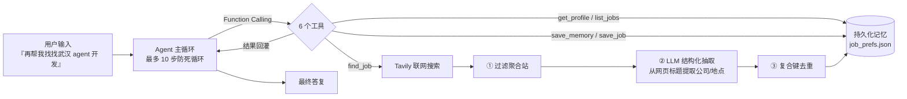

# 带记忆的求职助手 Agent

**不依赖任何 Agent 框架**，手写「意图理解 → 工具调用 → 结果回灌 → 终止判断」主循环。
基于 DeepSeek Function Calling 驱动 6 个工具 + Tavily 联网搜索，带三类持久化记忆
（用户画像 / 岗位库 / 搜索词）；搜索结果过滤、复合去重、存储容错全部自己实现。

> 个人求职场景自用项目。重点不在「能搜到岗位」，而在把 **LLM 工具调用 + 状态持久化 + 数据可靠性** 这套工程问题做扎实。

---

## 它解决什么问题

常见的求职工具基本都有三个毛病：

| 毛病 | 本项目怎么解 |
|---|---|
| 每次打开都要重新说一遍偏好（城市、技能、薪资） | **用户画像**持久化：说一次就记住，下次直接读 |
| 搜索结果一半是招聘聚合站，点进去还要再跳一次 | **域名级过滤**：聚合站域名黑名单，优先返回企业官网 `careers.` / `jobs.` 子域 |
| 隔天再搜，重复岗位照样再出现一遍 | **复合键去重**：URL 归一化优先，跨站也能认出同一个岗位 |
| 数据被清空程序却装作没事 | **三道写入保险** + 回退链 + 滚动备份，读到 0 字节文件会告警自救 |

---

## 快速开始

```bash
git clone https://github.com/dadalixu/smart-job-agent.git
cd smart-job-agent

pip install -r requirements.txt

# 配置密钥（二选一）
cp .env.example .env          # 然后填入真实 key
#  或直接设环境变量
#  Windows:  set DEEPSEEK_API_KEY=sk-xxx
#  macOS/Linux: export DEEPSEEK_API_KEY=sk-xxx

python agent.py selftest      # 先跑离线自测：27 项，不联网、不需要密钥
python agent.py diag          # 联网自检：DNS / TCP / 密钥一次探明，区分代码问题与网络问题
python agent.py               # 交互式对话
```

需要两个密钥：

- `DEEPSEEK_API_KEY` —— [platform.deepseek.com](https://platform.deepseek.com)，用于驱动工具调用
- `TAVILY_API_KEY` —— [tavily.com](https://tavily.com)，用于联网搜索（免费额度 1000 次/月）

---

## 工作流程



主循环是标准的 Function Calling 闭环：模型决定调用哪个工具 → 执行 → 把结果回灌上下文 → 模型判断是否还需要工具 → 不需要则输出最终答案。每一步都有超时与重试边界。

---

## 四个核心设计

### 1. 手写主循环，不用框架

`agent()` 函数完整实现了工具调用闭环，没有引入 LangChain / LangGraph。6 个工具的 JSON Schema 用两个构造函数生成：

```python
def _tool(name, desc, props=None, required=()): ...
def _p(type_, desc, **extra): ...

tools = [
    _tool("find_job", "联网搜索岗位，自动过滤聚合站、自动去重并写入记忆。",
          {"query": _p("string", "搜索关键词，例如『武汉 agent 开发 招聘』")},
          ["query"]),
    ...
]
```

相比手写 98 行完整 Schema，构造器写法只有 35 行，且 `required` 语义完全等价。模型返回的工具名或参数不合法时，会把错误信息回灌给模型让它自我纠正，而不是直接抛异常。

### 2. 三级复合去重键

去重键按可靠性从高到低递降：

```python
def _url_key(url):
    """URL 归一化：小写、去协议、去 www、去尾部斜杠与查询参数。"""
    p = urlparse((url or "").strip().lower())
    host = p.hostname or ""
    host = host[4:] if host.startswith("www.") else host
    return f"{host}{p.path.rstrip('/')}"

def _job_key(job):
    url_key = _url_key(job.get("source"))
    if url_key:                                   # ① 有 URL → 用 URL，最可靠
        return ("U", url_key)
    if job.get("company"):                        # ② 无 URL → 公司+岗位+地点
        return ("C", _normalize(job["company"]), _normalize(job["title"]), ...)
    if job.get("title"):                          # ③ 兜底 → 标题
        return ("T", _normalize(job["title"]))
    return None
```

**键在每次读取时现算，所以改去重算法不需要做数据迁移。**

这里踩过一个真实的坑：早期版本 `company` 字段写死为空字符串，导致所有记录都退化到第 ③ 级「标题匹配」。而网页标题带站点后缀，同一个 URL 只要标题略有差异就会被当成两个岗位重复入库。修复方案是双管齐下 —— URL 归一化变成首选键（立刻止血），再加一次 LLM 调用做结构化抽取拿到真正的公司名（让跨站去重成立）。

### 3. 文本归一化：括号的两步处理

中文招聘标题形如 `【武汉Agent开发工程师招聘】-光庭信息武汉招聘信息`，直接删括号内容会把**岗位名整个删掉**。所以分两步：

```python
_BRACKETS = re.compile(r"[（(\[【][^）)\]】]*[）)\]】]")
_BRACKET_NOISE = ("职位信息", "急招", "hot", "new", ...)   # 只有内容是这些才整体删

def _normalize(text):
    # ① 整体删「纯噪声括号」（内容是 职位信息/急招/站点名 之类）
    # ② 剩余括号只去符号、保留内容 —— 【岗位名】里的岗位名必须留下
    # ③ 剥站点后缀 → 去空白 → 剥结尾通用词 → 剥标点
```

这个缺陷是**离线自测当场抓出来的**，不是靠肉眼 review。

### 4. 存储层：三道保险 + 回退链

记忆全部落在一个 JSON 文件里。数据可靠性按「读」和「写」两条线分别加固：

**读 —— 区分「没有数据」和「数据不可用」**

```python
def _read_json(path):
    if not os.path.exists(path):
        return None
    if os.path.getsize(path) == 0:                 # 0 字节 ≠ 没有记忆
        logger.warning("%s 是 0 字节（可能被外部清空），按不可用处理", ...)
        return None
    ...
```

旧版遇到 0 字节文件时 `json.load` 报错后静默返回空记忆 —— 数据没了，程序却装作一切正常。现在的回退链是 `主文件 → 主文件.bak`，任一层读到有效数据都会继续并告警。

**写 —— 三道保险**

```python
def _atomic_write(data, backup=True):
    payload = json.dumps(data, ensure_ascii=False, indent=2)
    if not payload.strip() or payload.strip() in ("{}", "null", "[]"):
        raise ValueError("拒绝写入空内容（上游数据异常，已放弃落盘）")
    _backup_mem_file()                             # ① 替换前滚动备份
    fd, tmp = tempfile.mkstemp(dir=BASE_DIR, suffix=".tmp")
    with os.fdopen(fd, "w", encoding="utf-8") as f:
        f.write(payload); f.flush(); os.fsync(f.fileno())
    # ② 序列化失败压根不会碰到原文件  ③ fsync 后原子替换
    os.replace(tmp, MEM_FILE)
```

备份滚存到 `backups/`，带 `%Y%m%d-%H%M%S` 时间戳，只保留最近 5 份 —— 单一 `.bak` 会被反复覆盖，出事后救不回来。配套命令：`backups` 列出、`restore` 恢复。

---

## 命令一览

| 命令 | 作用 |
|---|---|
| `python agent.py` | 交互式对话（支持多轮上下文，自动裁剪到最近 20 轮） |
| `python agent.py selftest` | **离线自测 27 项** —— 不联网、不需要密钥、不碰真实数据（全程沙箱） |
| `python agent.py diag` | 联网自检：DNS / TCP / HTTPS / 密钥逐项探测，直接给结论 |
| `python agent.py demo` | 内置演示 |
| `python agent.py clean [--dry-run]` | 清洗聚合站来源与重复岗位，先备份 |
| `python agent.py restore [备份名]` | 从备份恢复（默认最近一份） |
| `python agent.py backups` | 列出所有备份 |

`selftest` 是这个项目最值钱的一项：**改完代码先跑它**。全部在临时沙箱目录内执行，真实数据一个字节都不会被碰。

```
[1] 文本归一化            [6] 写入保险
[2] 复合去重键            [7] 回退链（主文件被清空/损坏/删除后均能读回）
[3] 聚合站过滤            [8] 岗位字段合并补全
[4] 记忆读写              [9] 多轮上下文裁剪
[5] 备份与恢复            [10] 岗位条数上限（500 条淘汰最旧）
```

---

## 项目结构

```
smart-job-agent/
├── agent.py                 # 全部实现（单文件，约 1200 行）
├── requirements.txt
├── .env.example             # 环境变量模板
├── .gitignore               # 排除记忆数据与备份
├── job_prefs.example.json   # 数据格式示例（脱敏）
└── README.md

# 首次运行后自动生成：
├── job_prefs.json           # 记忆数据（已 gitignore）
└── backups/                 # 滚动备份，保留最近 5 份（已 gitignore）
```

---

## 数据格式

三类记忆存在同一个 JSON 里：

```json
{
  "schema_version": 2,
  "profile": { "城市": "示例城市", "技能": ["Python", "SQL"] },
  "queries": ["示例城市 Python 开发 招聘"],
  "jobs": [
    {
      "title": "示例岗位名",
      "company": "示例公司",
      "location": "示例城市",
      "source": "https://careers.example.com/jobs/12345",
      "snippet": "岗位摘要……",
      "query": "示例城市 Python 开发 招聘",
      "found_at": "2026-01-01T00:00:00"
    }
  ]
}
```

`profile` 是标量/列表混合的键值域（`save_memory` 支持 `overwrite` / `append` 两种模式，`append` 时按「、，;」拆分并去重）；`jobs` 是岗位库，受 500 条上限约束，超出按 `found_at` 淘汰最旧。

---

## 关键取舍

- **为什么不用 LangChain**：这个项目的核心难点是「状态持久化 + 数据可靠性」，不是「拼装链路」。手写主循环只有 60 多行，换来完全可控的错误处理和上下文裁剪。
- **为什么用 JSON 而不是数据库**：单用户、数据量小（几百条岗位）、需要人可读可手改。代价是并发写需要自己加锁 —— 已用 `RLock` + 原子替换处理。
- **为什么 LLM 抽取可以关**：`USE_LLM_EXTRACT = False` 时退回原始网页标题模式，省掉每次搜索的额外调用（约几分钱）。抽取失败也会自动降级，不会阻塞主流程。

---

## 已知限制

- **依赖 Tavily 的网络可达性**。部分网络环境下 `api.tavily.com` 直连不通，此时 `find_job` 会快速失败并给出排查提示（不是卡死 60 秒）。`diag` 命令可以一键定位。
- **聚合站过滤是黑名单策略**，靠域名 + 品牌名匹配。新出现的聚合站需要手动加进 `JOB_AGGREGATOR_DOMAINS` / `JOB_AGGREGATOR_BRANDS`。
- **单文件约 1200 行**，没有拆包。个人项目规模下这样更好维护，但如果继续长大，`selftest` 应该拆到独立文件。
- **未做并发搜索**，多关键词是串行的。

---

## License

MIT
